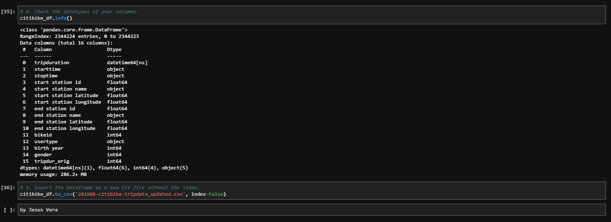
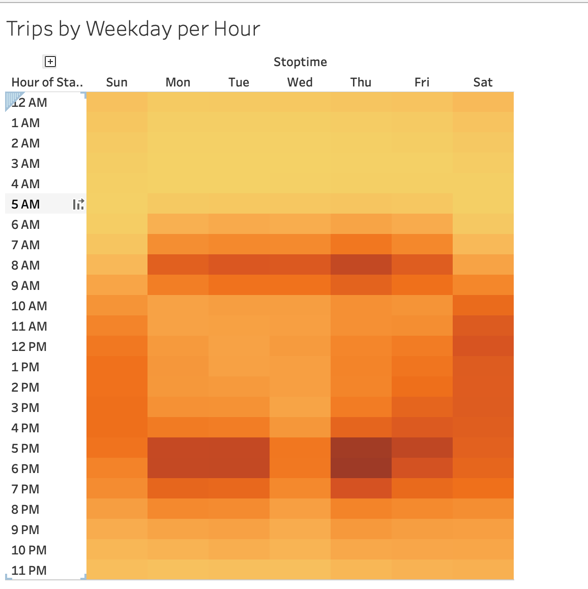

# bikesharing 

# Overview & Background

In this module, we worked with data visualization software called Tableau to present a business proposal for a bike-sharing company. First, you'll learn how to import, style, and portray data accurately. Then, you'll create worksheets, dashboards, and stories to visualize key data from a New York Citi Bike dataset.
What You Will Learn
By the end of this module, you will be able to:
•	Import data into Tableau.
•	Create and style worksheets, dashboards, and stories in Tableau.
•	Use Tableau worksheets to display data in a professional way.
•	Portray data accurately using Tableau dashboards.

Now that we've gotten a good idea of how to create our story, there is still some more work to be done to convince investors that a bike-sharing program in Des Moines is a solid business proposal. To solidify the proposal, one of the key stakeholders would like to see a bike trip analysis.

For this analysis, you’ll use Pandas to change the "tripduration" column from an integer to a datetime datatype. Then, using the converted datatype, you’ll create a set of visualizations to:

Show the length of time that bikes are checked out for all riders and genders
Show the number of bike trips for all riders and genders for each hour of each day of the week
Show the number of bike trips for each type of user and gender for each day of the week.
Finally, you’ll add these new visualizations to the two you created in this module for your final presentation and analysis to pitch to investors.

What You're Creating
This new assignment consists of two technical analysis deliverables and a written report to present your results. You will submit the following:

Deliverable 1: Change Trip Duration to a Datetime Format
Deliverable 2: Create Visualizations for the Trip Analysis
Deliverable 3: Create a Story and Report for the Final Presentation

# Results

Deliverable 1: Change Trip Duration to a Datetime Format (20 points)
Deliverable 1 Instructions
Using Python and Pandas functions, you’ll convert the "tripduration" column from an integer to a datetime datatype to get the time in hours, minutes, and seconds (00:00:00). After you convert the "tripduration" column to a datetime dataytpe, you’ll export the DataFrame as a CSV file to use for the trip analysis in Deliverable 2.

Deliverable 2: Create Visualizations for the Trip Analysis (50 points)
Deliverable 2 Instructions
Using Tableau, create visualizations that show:

How long bikes are checked out for all riders and genders.
How many trips are taken by the hour for each day of the week, for all riders and genders.
A breakdown of what days of the week a user might be more likely to check out a bike, by type of user and gender.

Follow the instructions below to complete Deliverable 2.

In Tableau, create a new Story using visualizations that will support the key findings you want to show.

You must use the five visualizations that you created in Deliverable 2.
You must use at least two visualizations that you created in this module.
In your README markdown file, include the following:
Overview of the analysis: Explain the purpose of this analysis.
Results: Using the visualizations you have in your Tableau Story, describe the results of each visualization underneath the image.
Summary: Provide a high-level summary of the results and two additional visualizations that you would perform with the given dataset.

Create the Checkout Times for Users Viz
In this visualization, you’ll graph the length of time that bikes are checked out for all riders.

Add the number of records or the generated field that counts the number of records in the CSV file to the Rows.
Add the "tripduration" column you converted to the Columns, and filter the "More" option by "Hour".
Add the "tripduration" column again to the Columns, and filter the "More" option by "Minute", and then change the values from "discrete" to "continuous".
Add the "tripduration" column that shows the "Hour" to the Filters field, and select "Show Filter".
Edit the X and Y axis labels by right-clicking on the axis label and selecting "Edit Axis".
Your graph should look similar to the following image:

Create the Checkout Times by Gender Viz
In this visualization, you’ll graph the length of time that bikes are checked out for each gender.

Repeat steps 1-4 of the "Checkout Times for Users" visualization.
Add the converted column for gender as a color to the Marks field, add it to the Filters field, and select "Show Filter".
Edit the X and Y axis labels by right-clicking on the axis label and selecting "Edit Axis".
Your graph should look similar to the following image:

Create the Trips by Weekday for Each Hour Viz
In this visualization, you’ll graph the number of bike trips by weekday for each hour of the day as a heatmap.

Add the "Starttime" column to the Rows, and filter the "More" option by "Hour".
Add the "Stoptime" column to the Columns, and filter the “More” option by "Weekday".
Add the number of records or the generated field that counts the number of records in the CSV file to the Marks field as a color. Select "Automatic" for the type of graph to create the heatmap.
Format the Y axis of the Starttime by Hour to show the 12-hour format, as shown in the following image:

Optional: Format the X axis of Stoptime by Weekday as "Abbreviation".
Your graph should look similar to the following image:

Create the Trips by Gender (Weekday per Hour) Viz
In this visualization, you’ll graph the number of bike trips by gender for each hour of each day of the week as a heatmap.

Repeat steps 1-3 from the "Trips by Weekday per Hour" visualization.
Add the converted column for "Gender" to the Columns and to the Filters field, and select "Show Filter".
Format the Y axis of the Starttime by Hour to show the 12-hour format.
Optional: Format the X axis of Stoptime by Weekday as "Abbreviation".
Your graph should look similar to the following image:

Create the User Trips by Gender by Weekday Viz
In this visualization, you’ll graph the number of bike trips by gender for each hour for each day of the week as a heatmap.

Add the converted column for "Gender" to the Columns and to the Filters field, and select "Show Filter".
Add the "Usertype" to the Rows and to the Filters field, and select "Show Filter".
Add the "Starttime" column to the Rows, and filter the "More" option by "Weekday".
Add the number of records or the generated field that counts the number of records in the CSV file to the Marks field as a color. Select "Automatic" for the type of graph to create the heatmap.
Your graph should look similar to the following image:

Deliverable 3 Requirements
You will earn a perfect score for Deliverable 3 by completing all requirements below:

Structure, Organization, and Formatting (6 points)
The written analysis has the following structure, organization, and formatting:

# Summary:
There is a high-level summary of the results and two additional visualizations are suggested for future analysis

In this module, we worked with data visualization software called Tableau to present a business proposal for a bike-sharing company. I learned how to import, style, and portray data accurately. I created worksheets, dashboards, and stories to visualize key data from a New York Citi Bike dataset.

In the Story we included multiples dashboards with the following analysis.
- Trips by Gender by Weekday
- Trips by Gender (Weekday Per Hour)
- Checkout times by Gender 
- Checkout times by User
- Trips by Weekday per hour
- Agugust Peak Hours 
- Top Starting Locations 

https://public.tableau.com/views/Des-MoinesNYCCitiBikeSharingChallenge/NYCCitiBikeSharing?:language=en-US&:display_count=n&:origin=viz_share_link

<noscript></noscript><object class='tableauViz'  style='display:none;'><param name='host_url' value='https%3A%2F%2Fpublic.tableau.com%2F' /> <param name='embed_code_version' value='3' /> <param name='path' value='views&#47;Des-MoinesNYCCitiBikeSharingChallenge&#47;NYCCitiBikeSharing?:language=en-US&amp;:embed=true' /> <param name='toolbar' value='yes' /><param name='static_image' value='https:&#47;&#47;public.tableau.com&#47;static&#47;images&#47;De&#47;Des-MoinesNYCCitiBikeSharingChallenge&#47;NYCCitiBikeSharing&#47;1.png' /> <param name='animate_transition' value='yes' /><param name='display_static_image' value='yes' /><param name='display_spinner' value='yes' /><param name='display_overlay' value='yes' /><param name='display_count' value='yes' /><param name='language' value='en-US' /></object>
                
